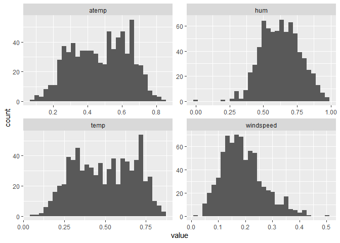
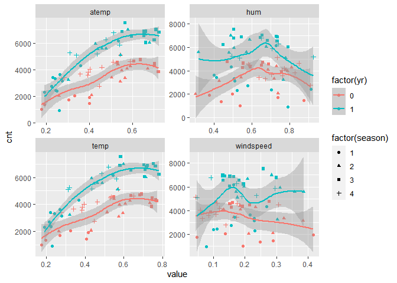
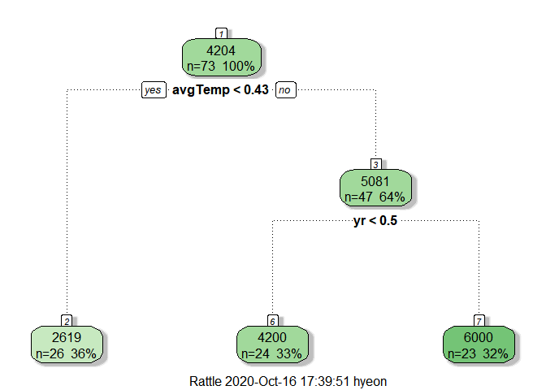
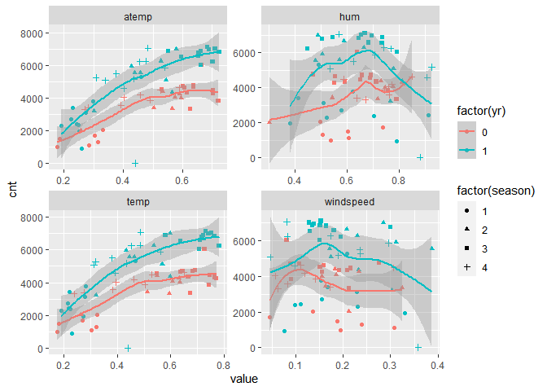

ST 558 Project 2
================
Hannah Park
10/15/2020

# Introduction

You should have an introduction section that briefly describes the data
and the variables you have to work with (no need to discuss all of them,
just the ones you want to use). **If you are analyzing the bike share
data, do not use the casual and registered variables to do any
modeling\!**

You should also mention the purpose of your analysis and the methods
you’ll use (no need to detail them here) for analysis.

See Figure .

# Data

``` r
# Read in data
url <- "https://archive.ics.uci.edu/ml/machine-learning-databases/00275/Bike-Sharing-Dataset.zip"
download.file(url, "Bike-Sharing-Dataset.zip")

unzip("Bike-Sharing-Dataset.zip", exdir = "./Data")
df.bike <- read_csv("/Data/day.csv") %>%
  select(-instant, -casual, -registered) %>%
  mutate(dayofweek = recode(weekday,
                            `0` = "Sunday",
                            `1` = "Monday",
                            `2` = "Tuesday",
                            `3` = "Wednesday",
                            `4` = "Thursday",
                            `5` = "Friday",
                            `6` = "Saturday"))
  #Combine variables temp and atemp

df.bike.day <- df.bike %>%
  filter(weekday == 1)

#Randomply sample from the data 
#Form training and test sets
train <- sample(1:nrow(df.bike.day), size = nrow(df.bike.day)*0.7)
test <- dplyr::setdiff(1:nrow(df.bike.day), train)
df.train <- df.bike.day[train, ]
df.test <- df.bike.day[test, ]
```

# Summarizations

## Full Data

### Correlation Plot

``` r
corrplot(cor(df.bike[,2:13]))
```


``` r
#Qualitative variables: Contingency tables


#Quantitative variables: Summary statistics


#Histograms of quantitative variables
df.bike %>%
  gather(temp, atemp, hum, windspeed, key = "var", value = "value") %>%
  ggplot(aes(x = value)) +
  geom_histogram() +
  facet_wrap(~var, scales = "free") 
```

    ## `stat_bin()` using `bins = 30`. Pick better value with `binwidth`.

<!-- -->

``` r
#Scatterplot of response variable(cnt) over days
ggplot(df.bike, aes(x = dteday, y = cnt)) +
  geom_point(aes(colour = factor(holiday)))
```

<!-- -->

## Specific Day of the Week Data

``` r
df.train %>%
  gather(temp, atemp, hum, windspeed, key = "var", value = "value") %>%
  ggplot(aes(x = value)) +
  geom_histogram() +
  facet_wrap(~var, scales = "free") 
```

    ## `stat_bin()` using `bins = 30`. Pick better value with `binwidth`.

<!-- -->

``` r
df.train %>%
  gather(temp, atemp, hum, windspeed, key = "var", value = "value") %>%
  ggplot(aes(x = value, y = cnt, color = factor(yr), shape = factor(season))) +
  geom_point() +
  geom_smooth(aes(group = factor(yr))) +
  facet_wrap(~var, scales = "free") 
```

    ## `geom_smooth()` using method = 'loess' and formula 'y ~ x'

<!-- -->
