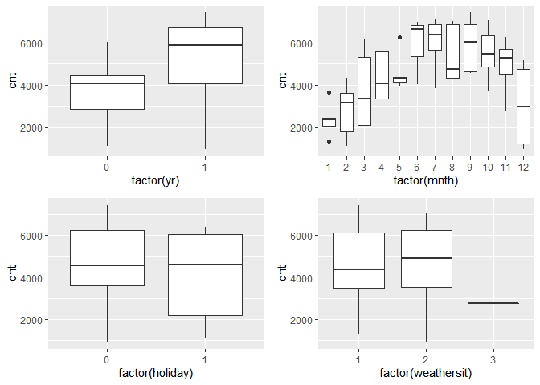
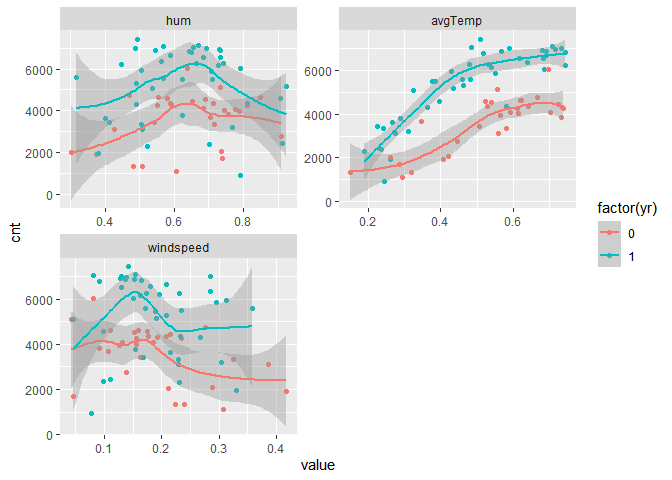

ST 558 Project 2
================
Hannah Park
10/15/2020

# Introduction

You should have an introduction section that briefly describes the data
and the variables you have to work with (no need to discuss all of them,
just the ones you want to use). **If you are analyzing the bike share
data, do not use the casual and registered variables to do any
modeling\!**

You should also mention the purpose of your analysis and the methods
you’ll use (no need to detail them here) for analysis.

# Data

``` r
# Read in data
url <- "https://archive.ics.uci.edu/ml/machine-learning-databases/00275/Bike-Sharing-Dataset.zip"
download.file(url, "Bike-Sharing-Dataset.zip")

unzip("Bike-Sharing-Dataset.zip", exdir = "./Data")
df.bike <- read_csv("/Data/day.csv") %>%
  select(-instant, -casual, -registered) %>%
  mutate(dayofweek = dplyr::recode(weekday,
                            `0` = "Sunday",
                            `1` = "Monday",
                            `2` = "Tuesday",
                            `3` = "Wednesday",
                            `4` = "Thursday",
                            `5` = "Friday",
                            `6` = "Saturday")) %>%
  #Combine variables temp and atemp 
  mutate(avgTemp = (temp+atemp)/2)

df.bike.day <- df.bike %>%
  filter(weekday == 1)

#Randomply sample from the data 
#Form training and test sets
train <- sample(1:nrow(df.bike.day), size = nrow(df.bike.day)*0.7)
test <- dplyr::setdiff(1:nrow(df.bike.day), train)
df.train <- df.bike.day[train, ]
df.test <- df.bike.day[test, ]
```

# Summarizations

## Full Data

Original data is used for full data exploratory analysis.

#### Figure 1. Correlation plot

``` r
corrplot(cor(df.bike[,2:13]))
```


#### Table 1. Qualitative variables: Contingency tables

``` r
df.tbl <- apply_labels(df.bike,
                       holiday = "Holiday",
                       holiday = c("No" = 0,
                                   "Yes" = 1),
                       weathersit = "Weather",
                       weathersit = c("Good" = 1,
                                      "Moderate" = 2,
                                      "Bad" = 3,
                                      "Extreme" = 4),
                       dayofweek = "Day of Week")
attach(df.tbl)
cro_cases(list(holiday, weathersit), dayofweek,
          total_row_position = "none")
```

<table class="gmisc_table" style="border-collapse: collapse; margin-top: 1em; margin-bottom: 1em;">

<thead>

<tr>

<th style="border-top: 2px solid grey;">

</th>

<th colspan="7" style="font-weight: 900; border-bottom: 1px solid grey; border-top: 2px solid grey; text-align: center;">

 Day of Week 

</th>

</tr>

<tr>

<th style="border-bottom: 1px solid grey; font-weight: 900; text-align: center;">

</th>

<th style="font-weight: 900; border-bottom: 1px solid grey; text-align: center;">

 Friday 

</th>

<th style="font-weight: 900; border-bottom: 1px solid grey; text-align: center;">

 Monday 

</th>

<th style="font-weight: 900; border-bottom: 1px solid grey; text-align: center;">

 Saturday 

</th>

<th style="font-weight: 900; border-bottom: 1px solid grey; text-align: center;">

 Sunday 

</th>

<th style="font-weight: 900; border-bottom: 1px solid grey; text-align: center;">

 Thursday 

</th>

<th style="font-weight: 900; border-bottom: 1px solid grey; text-align: center;">

 Tuesday 

</th>

<th style="font-weight: 900; border-bottom: 1px solid grey; text-align: center;">

 Wednesday 

</th>

</tr>

</thead>

<tbody>

<tr>

<td colspan="8" style="font-weight: 900;">

 Holiday 

</td>

</tr>

<tr>

<td style="text-align: left;">

   No 

</td>

<td style="text-align: right;">

102

</td>

<td style="text-align: right;">

90

</td>

<td style="text-align: right;">

105

</td>

<td style="text-align: right;">

105

</td>

<td style="text-align: right;">

102

</td>

<td style="text-align: right;">

103

</td>

<td style="text-align: right;">

103

</td>

</tr>

<tr>

<td style="text-align: left;">

   Yes 

</td>

<td style="text-align: right;">

2

</td>

<td style="text-align: right;">

15

</td>

<td style="text-align: right;">

</td>

<td style="text-align: right;">

</td>

<td style="text-align: right;">

2

</td>

<td style="text-align: right;">

1

</td>

<td style="text-align: right;">

1

</td>

</tr>

<tr>

<td colspan="8" style="font-weight: 900;">

 Weather 

</td>

</tr>

<tr>

<td style="text-align: left;">

   Good 

</td>

<td style="text-align: right;">

63

</td>

<td style="text-align: right;">

66

</td>

<td style="text-align: right;">

67

</td>

<td style="text-align: right;">

74

</td>

<td style="text-align: right;">

67

</td>

<td style="text-align: right;">

62

</td>

<td style="text-align: right;">

64

</td>

</tr>

<tr>

<td style="text-align: left;">

   Moderate 

</td>

<td style="text-align: right;">

41

</td>

<td style="text-align: right;">

37

</td>

<td style="text-align: right;">

34

</td>

<td style="text-align: right;">

30

</td>

<td style="text-align: right;">

34

</td>

<td style="text-align: right;">

38

</td>

<td style="text-align: right;">

33

</td>

</tr>

<tr>

<td style="text-align: left;">

   Bad 

</td>

<td style="text-align: right;">

</td>

<td style="text-align: right;">

2

</td>

<td style="text-align: right;">

4

</td>

<td style="text-align: right;">

1

</td>

<td style="text-align: right;">

3

</td>

<td style="text-align: right;">

4

</td>

<td style="text-align: right;">

7

</td>

</tr>

<tr>

<td style="border-bottom: 2px solid grey; text-align: left;">

   Extreme 

</td>

<td style="border-bottom: 2px solid grey; text-align: right;">

</td>

<td style="border-bottom: 2px solid grey; text-align: right;">

</td>

<td style="border-bottom: 2px solid grey; text-align: right;">

</td>

<td style="border-bottom: 2px solid grey; text-align: right;">

</td>

<td style="border-bottom: 2px solid grey; text-align: right;">

</td>

<td style="border-bottom: 2px solid grey; text-align: right;">

</td>

<td style="border-bottom: 2px solid grey; text-align: right;">

</td>

</tr>

</tbody>

</table>

``` r
detach(df.tbl)
```

#### Figure 2. Histograms of quantitative variables

``` r
df.bike %>%
  gather(avgTemp, hum, windspeed, key = "var", value = "value") %>%
  mutate(var = factor(var, levels = c("hum", "avgTemp", "windspeed"))) %>%
  ggplot(aes(x = value)) +
  geom_histogram(bins = 50) +
  facet_wrap(~var, scales = "free", nrow = 2) 
```

<!-- -->

#### Figure 3. Scatterplot of response variable(cnt) over days

``` r
ggplot(df.bike, aes(x = dteday, y = cnt)) +
  geom_point(aes(colour = factor(holiday)))
```

<!-- -->

## Specific Day of the Week Data

Training data is used.

#### Table 2. Qualitative variables: Contingency tables

``` r
df.tbl.train <- apply_labels(df.train,
                       holiday = "Holiday",
                       holiday = c("No" = 0,
                                   "Yes" = 1),
                       weathersit = "Weather",
                       weathersit = c("Good" = 1,
                                      "Moderate" = 2,
                                      "Bad" = 3,
                                      "Extreme" = 4),
                       dayofweek = "Day of Week")
attach(df.tbl.train)
cro_cases(weathersit, mnth,
          total_row_position = "none")
```

<table class="gmisc_table" style="border-collapse: collapse; margin-top: 1em; margin-bottom: 1em;">

<thead>

<tr>

<th style="border-top: 2px solid grey;">

</th>

<th colspan="12" style="font-weight: 900; border-bottom: 1px solid grey; border-top: 2px solid grey; text-align: center;">

 mnth 

</th>

</tr>

<tr>

<th style="border-bottom: 1px solid grey; font-weight: 900; text-align: center;">

</th>

<th style="font-weight: 900; border-bottom: 1px solid grey; text-align: center;">

 1 

</th>

<th style="font-weight: 900; border-bottom: 1px solid grey; text-align: center;">

 2 

</th>

<th style="font-weight: 900; border-bottom: 1px solid grey; text-align: center;">

 3 

</th>

<th style="font-weight: 900; border-bottom: 1px solid grey; text-align: center;">

 4 

</th>

<th style="font-weight: 900; border-bottom: 1px solid grey; text-align: center;">

 5 

</th>

<th style="font-weight: 900; border-bottom: 1px solid grey; text-align: center;">

 6 

</th>

<th style="font-weight: 900; border-bottom: 1px solid grey; text-align: center;">

 7 

</th>

<th style="font-weight: 900; border-bottom: 1px solid grey; text-align: center;">

 8 

</th>

<th style="font-weight: 900; border-bottom: 1px solid grey; text-align: center;">

 9 

</th>

<th style="font-weight: 900; border-bottom: 1px solid grey; text-align: center;">

 10 

</th>

<th style="font-weight: 900; border-bottom: 1px solid grey; text-align: center;">

 11 

</th>

<th style="font-weight: 900; border-bottom: 1px solid grey; text-align: center;">

 12 

</th>

</tr>

</thead>

<tbody>

<tr>

<td colspan="13" style="font-weight: 900;">

 Weather 

</td>

</tr>

<tr>

<td style="text-align: left;">

   Good 

</td>

<td style="text-align: right;">

4

</td>

<td style="text-align: right;">

6

</td>

<td style="text-align: right;">

4

</td>

<td style="text-align: right;">

6

</td>

<td style="text-align: right;">

3

</td>

<td style="text-align: right;">

1

</td>

<td style="text-align: right;">

6

</td>

<td style="text-align: right;">

7

</td>

<td style="text-align: right;">

2

</td>

<td style="text-align: right;">

4

</td>

<td style="text-align: right;">

2

</td>

<td style="text-align: right;">

1

</td>

</tr>

<tr>

<td style="text-align: left;">

   Moderate 

</td>

<td style="text-align: right;">

2

</td>

<td style="text-align: right;">

1

</td>

<td style="text-align: right;">

1

</td>

<td style="text-align: right;">

3

</td>

<td style="text-align: right;">

3

</td>

<td style="text-align: right;">

2

</td>

<td style="text-align: right;">

2

</td>

<td style="text-align: right;">

2

</td>

<td style="text-align: right;">

3

</td>

<td style="text-align: right;">

3

</td>

<td style="text-align: right;">

1

</td>

<td style="text-align: right;">

3

</td>

</tr>

<tr>

<td style="text-align: left;">

   Bad 

</td>

<td style="text-align: right;">

</td>

<td style="text-align: right;">

</td>

<td style="text-align: right;">

</td>

<td style="text-align: right;">

</td>

<td style="text-align: right;">

</td>

<td style="text-align: right;">

</td>

<td style="text-align: right;">

</td>

<td style="text-align: right;">

</td>

<td style="text-align: right;">

</td>

<td style="text-align: right;">

</td>

<td style="text-align: right;">

1

</td>

<td style="text-align: right;">

</td>

</tr>

<tr>

<td style="border-bottom: 2px solid grey; text-align: left;">

   Extreme 

</td>

<td style="border-bottom: 2px solid grey; text-align: right;">

</td>

<td style="border-bottom: 2px solid grey; text-align: right;">

</td>

<td style="border-bottom: 2px solid grey; text-align: right;">

</td>

<td style="border-bottom: 2px solid grey; text-align: right;">

</td>

<td style="border-bottom: 2px solid grey; text-align: right;">

</td>

<td style="border-bottom: 2px solid grey; text-align: right;">

</td>

<td style="border-bottom: 2px solid grey; text-align: right;">

</td>

<td style="border-bottom: 2px solid grey; text-align: right;">

</td>

<td style="border-bottom: 2px solid grey; text-align: right;">

</td>

<td style="border-bottom: 2px solid grey; text-align: right;">

</td>

<td style="border-bottom: 2px solid grey; text-align: right;">

</td>

<td style="border-bottom: 2px solid grey; text-align: right;">

</td>

</tr>

</tbody>

</table>

``` r
detach(df.tbl.train)
```

#### Table 3. Quantitative variables: Summary statistics

``` r
df.tbl.train %>%
  tab_cells(avgTemp, hum, windspeed) %>%
  tab_cols(mnth) %>%
  tab_stat_fun(Minimum = w_min, Median = w_median, 
               Mean = w_mean, Max = w_max) %>%
  tab_pivot()
```

<table class="gmisc_table" style="border-collapse: collapse; margin-top: 1em; margin-bottom: 1em;">

<thead>

<tr>

<th style="border-top: 2px solid grey;">

</th>

<th colspan="12" style="font-weight: 900; border-bottom: 1px solid grey; border-top: 2px solid grey; text-align: center;">

 mnth 

</th>

</tr>

<tr>

<th style="border-bottom: 1px solid grey; font-weight: 900; text-align: center;">

</th>

<th style="font-weight: 900; border-bottom: 1px solid grey; text-align: center;">

 1 

</th>

<th style="font-weight: 900; border-bottom: 1px solid grey; text-align: center;">

 2 

</th>

<th style="font-weight: 900; border-bottom: 1px solid grey; text-align: center;">

 3 

</th>

<th style="font-weight: 900; border-bottom: 1px solid grey; text-align: center;">

 4 

</th>

<th style="font-weight: 900; border-bottom: 1px solid grey; text-align: center;">

 5 

</th>

<th style="font-weight: 900; border-bottom: 1px solid grey; text-align: center;">

 6 

</th>

<th style="font-weight: 900; border-bottom: 1px solid grey; text-align: center;">

 7 

</th>

<th style="font-weight: 900; border-bottom: 1px solid grey; text-align: center;">

 8 

</th>

<th style="font-weight: 900; border-bottom: 1px solid grey; text-align: center;">

 9 

</th>

<th style="font-weight: 900; border-bottom: 1px solid grey; text-align: center;">

 10 

</th>

<th style="font-weight: 900; border-bottom: 1px solid grey; text-align: center;">

 11 

</th>

<th style="font-weight: 900; border-bottom: 1px solid grey; text-align: center;">

 12 

</th>

</tr>

</thead>

<tbody>

<tr>

<td colspan="13" style="font-weight: 900;">

 avgTemp 

</td>

</tr>

<tr>

<td style="text-align: left;">

   Minimum 

</td>

<td style="text-align: right;">

0.2

</td>

<td style="text-align: right;">

0.2

</td>

<td style="text-align: right;">

0.2

</td>

<td style="text-align: right;">

0.3

</td>

<td style="text-align: right;">

0.5

</td>

<td style="text-align: right;">

0.6

</td>

<td style="text-align: right;">

0.7

</td>

<td style="text-align: right;">

0.6

</td>

<td style="text-align: right;">

0.5

</td>

<td style="text-align: right;">

0.3

</td>

<td style="text-align: right;">

0.3

</td>

<td style="text-align: right;">

0.2

</td>

</tr>

<tr>

<td style="text-align: left;">

   Median 

</td>

<td style="text-align: right;">

0.2

</td>

<td style="text-align: right;">

0.3

</td>

<td style="text-align: right;">

0.4

</td>

<td style="text-align: right;">

0.5

</td>

<td style="text-align: right;">

0.6

</td>

<td style="text-align: right;">

0.6

</td>

<td style="text-align: right;">

0.7

</td>

<td style="text-align: right;">

0.7

</td>

<td style="text-align: right;">

0.6

</td>

<td style="text-align: right;">

0.5

</td>

<td style="text-align: right;">

0.4

</td>

<td style="text-align: right;">

0.4

</td>

</tr>

<tr>

<td style="text-align: left;">

   Mean 

</td>

<td style="text-align: right;">

0.2

</td>

<td style="text-align: right;">

0.3

</td>

<td style="text-align: right;">

0.4

</td>

<td style="text-align: right;">

0.5

</td>

<td style="text-align: right;">

0.6

</td>

<td style="text-align: right;">

0.6

</td>

<td style="text-align: right;">

0.7

</td>

<td style="text-align: right;">

0.7

</td>

<td style="text-align: right;">

0.6

</td>

<td style="text-align: right;">

0.5

</td>

<td style="text-align: right;">

0.4

</td>

<td style="text-align: right;">

0.3

</td>

</tr>

<tr>

<td style="text-align: left;">

   Max 

</td>

<td style="text-align: right;">

0.3

</td>

<td style="text-align: right;">

0.4

</td>

<td style="text-align: right;">

0.5

</td>

<td style="text-align: right;">

0.6

</td>

<td style="text-align: right;">

0.7

</td>

<td style="text-align: right;">

0.7

</td>

<td style="text-align: right;">

0.7

</td>

<td style="text-align: right;">

0.7

</td>

<td style="text-align: right;">

0.7

</td>

<td style="text-align: right;">

0.6

</td>

<td style="text-align: right;">

0.5

</td>

<td style="text-align: right;">

0.4

</td>

</tr>

<tr>

<td colspan="13" style="font-weight: 900;">

 hum 

</td>

</tr>

<tr>

<td style="text-align: left;">

   Minimum 

</td>

<td style="text-align: right;">

0.4

</td>

<td style="text-align: right;">

0.4

</td>

<td style="text-align: right;">

0.3

</td>

<td style="text-align: right;">

0.3

</td>

<td style="text-align: right;">

0.6

</td>

<td style="text-align: right;">

0.5

</td>

<td style="text-align: right;">

0.4

</td>

<td style="text-align: right;">

0.5

</td>

<td style="text-align: right;">

0.5

</td>

<td style="text-align: right;">

0.6

</td>

<td style="text-align: right;">

0.5

</td>

<td style="text-align: right;">

0.5

</td>

</tr>

<tr>

<td style="text-align: left;">

   Median 

</td>

<td style="text-align: right;">

0.5

</td>

<td style="text-align: right;">

0.5

</td>

<td style="text-align: right;">

0.5

</td>

<td style="text-align: right;">

0.6

</td>

<td style="text-align: right;">

0.7

</td>

<td style="text-align: right;">

0.6

</td>

<td style="text-align: right;">

0.7

</td>

<td style="text-align: right;">

0.6

</td>

<td style="text-align: right;">

0.7

</td>

<td style="text-align: right;">

0.7

</td>

<td style="text-align: right;">

0.7

</td>

<td style="text-align: right;">

0.8

</td>

</tr>

<tr>

<td style="text-align: left;">

   Mean 

</td>

<td style="text-align: right;">

0.6

</td>

<td style="text-align: right;">

0.5

</td>

<td style="text-align: right;">

0.6

</td>

<td style="text-align: right;">

0.6

</td>

<td style="text-align: right;">

0.7

</td>

<td style="text-align: right;">

0.6

</td>

<td style="text-align: right;">

0.6

</td>

<td style="text-align: right;">

0.6

</td>

<td style="text-align: right;">

0.7

</td>

<td style="text-align: right;">

0.7

</td>

<td style="text-align: right;">

0.7

</td>

<td style="text-align: right;">

0.8

</td>

</tr>

<tr>

<td style="text-align: left;">

   Max 

</td>

<td style="text-align: right;">

0.9

</td>

<td style="text-align: right;">

0.7

</td>

<td style="text-align: right;">

0.7

</td>

<td style="text-align: right;">

0.8

</td>

<td style="text-align: right;">

0.8

</td>

<td style="text-align: right;">

0.7

</td>

<td style="text-align: right;">

0.8

</td>

<td style="text-align: right;">

0.7

</td>

<td style="text-align: right;">

0.8

</td>

<td style="text-align: right;">

0.7

</td>

<td style="text-align: right;">

0.9

</td>

<td style="text-align: right;">

0.9

</td>

</tr>

<tr>

<td colspan="13" style="font-weight: 900;">

 windspeed 

</td>

</tr>

<tr>

<td style="text-align: left;">

   Minimum 

</td>

<td style="text-align: right;">

0.1

</td>

<td style="text-align: right;">

0.0

</td>

<td style="text-align: right;">

0.2

</td>

<td style="text-align: right;">

0.2

</td>

<td style="text-align: right;">

0.1

</td>

<td style="text-align: right;">

0.2

</td>

<td style="text-align: right;">

0.1

</td>

<td style="text-align: right;">

0.1

</td>

<td style="text-align: right;">

0.1

</td>

<td style="text-align: right;">

0.0

</td>

<td style="text-align: right;">

0.0

</td>

<td style="text-align: right;">

0.1

</td>

</tr>

<tr>

<td style="text-align: left;">

   Median 

</td>

<td style="text-align: right;">

0.2

</td>

<td style="text-align: right;">

0.2

</td>

<td style="text-align: right;">

0.2

</td>

<td style="text-align: right;">

0.3

</td>

<td style="text-align: right;">

0.2

</td>

<td style="text-align: right;">

0.2

</td>

<td style="text-align: right;">

0.2

</td>

<td style="text-align: right;">

0.2

</td>

<td style="text-align: right;">

0.2

</td>

<td style="text-align: right;">

0.1

</td>

<td style="text-align: right;">

0.2

</td>

<td style="text-align: right;">

0.1

</td>

</tr>

<tr>

<td style="text-align: left;">

   Mean 

</td>

<td style="text-align: right;">

0.2

</td>

<td style="text-align: right;">

0.2

</td>

<td style="text-align: right;">

0.2

</td>

<td style="text-align: right;">

0.3

</td>

<td style="text-align: right;">

0.2

</td>

<td style="text-align: right;">

0.2

</td>

<td style="text-align: right;">

0.2

</td>

<td style="text-align: right;">

0.2

</td>

<td style="text-align: right;">

0.1

</td>

<td style="text-align: right;">

0.1

</td>

<td style="text-align: right;">

0.1

</td>

<td style="text-align: right;">

0.2

</td>

</tr>

<tr>

<td style="border-bottom: 2px solid grey; text-align: left;">

   Max 

</td>

<td style="border-bottom: 2px solid grey; text-align: right;">

0.3

</td>

<td style="border-bottom: 2px solid grey; text-align: right;">

0.4

</td>

<td style="border-bottom: 2px solid grey; text-align: right;">

0.3

</td>

<td style="border-bottom: 2px solid grey; text-align: right;">

0.4

</td>

<td style="border-bottom: 2px solid grey; text-align: right;">

0.2

</td>

<td style="border-bottom: 2px solid grey; text-align: right;">

0.3

</td>

<td style="border-bottom: 2px solid grey; text-align: right;">

0.2

</td>

<td style="border-bottom: 2px solid grey; text-align: right;">

0.3

</td>

<td style="border-bottom: 2px solid grey; text-align: right;">

0.2

</td>

<td style="border-bottom: 2px solid grey; text-align: right;">

0.3

</td>

<td style="border-bottom: 2px solid grey; text-align: right;">

0.2

</td>

<td style="border-bottom: 2px solid grey; text-align: right;">

0.2

</td>

</tr>

</tbody>

</table>

#### Figure 4. Qualitative variables: Boxplots

``` r
boxplot1 <- df.train %>%
  ggplot(aes(x = factor(mnth), y = cnt)) +
  geom_boxplot()

boxplot2 <- df.train %>%
  ggplot(aes(x = factor(weathersit), y = cnt)) +
  geom_boxplot() 

boxplot3 <- df.train %>%
  ggplot(aes(x = factor(holiday), y = cnt)) +
  geom_boxplot() 

boxplot4 <- df.train %>%
  ggplot(aes(x = factor(yr), y = cnt)) +
  geom_boxplot()

grid.arrange(boxplot4, boxplot1, boxplot3, boxplot2)
```

<!-- -->

#### Figure 5. Quantitative variables: Scatterplots

``` r
df.train %>%
  gather(avgTemp, hum, windspeed, key = "var", value = "value") %>%
  mutate(var = factor(var, levels = c("hum", "avgTemp", "windspeed"))) %>%
  ggplot(aes(x = value, y = cnt, color = factor(yr))) +
  geom_point() +
  geom_smooth(aes(group = factor(yr))) +
  facet_wrap(~var, scales = "free", nrow = 2) 
```

    ## `geom_smooth()` using method = 'loess' and formula 'y ~ x'

<!-- -->

# Modeling

## Tree-based Model

``` r
treeFit <- train(cnt ~ yr + mnth + holiday + weathersit + avgTemp + hum + windspeed, data = df.train,
                  method = "rpart",
                  trControl = trainControl(method = "LOOCV")
                  )
treeFit$results
```

    ##          cp     RMSE     Rsquared       MAE
    ## 1 0.0494698 1015.236 0.6644087756  820.3415
    ## 2 0.2883853 1467.754 0.3225465226 1298.4655
    ## 3 0.4604987 1886.827 0.0001999059 1707.5987

``` r
treePred <- predict(treeFit, newdata = df.test)
treeRMSE <- sqrt(mean((treePred-df.test$cnt)^2))
```

## Boosted Tree Model

``` r
boostFit <- train(cnt ~ yr + mnth + holiday + weathersit + avgTemp + hum + windspeed, data = df.train,
                  method = "gbm",
                  trControl = trainControl(method = "cv", number = 10),
                  preProcess = c("center", "scale"),
                  verbose = FALSE)
boostFit$results
```

    ##   shrinkage interaction.depth n.minobsinnode n.trees     RMSE  Rsquared
    ## 1       0.1                 1             10      50 757.7032 0.8365994
    ## 4       0.1                 2             10      50 718.0798 0.8442327
    ## 7       0.1                 3             10      50 706.4724 0.8435031
    ## 2       0.1                 1             10     100 732.6253 0.8482311
    ## 5       0.1                 2             10     100 709.5150 0.8515073
    ## 8       0.1                 3             10     100 698.6894 0.8454125
    ## 3       0.1                 1             10     150 728.0524 0.8538903
    ## 6       0.1                 2             10     150 725.8167 0.8475254
    ## 9       0.1                 3             10     150 711.8457 0.8421098
    ##        MAE   RMSESD RsquaredSD     MAESD
    ## 1 583.4194 219.7747 0.09147219 101.63334
    ## 4 539.3670 268.0776 0.09123988 146.52615
    ## 7 536.3961 264.2803 0.08629031 155.61062
    ## 2 558.0527 212.0138 0.09238842  73.55455
    ## 5 527.3135 224.1725 0.08780408 107.48803
    ## 8 522.1391 274.7072 0.08697576 163.86355
    ## 3 552.3399 190.5780 0.08495448  58.26536
    ## 6 539.3820 213.0068 0.08680548  97.61807
    ## 9 526.9985 257.4165 0.09525579 164.10315

``` r
boostPred <- predict(boostFit, newdata = df.test)
boostRMSE <- sqrt(mean((boostPred-df.test$cnt)^2))
```

# Model Comparison

``` r
tbl.rmse <- rbind.data.frame("tree" = treeRMSE, "boost" = boostRMSE)
colnames(tbl.rmse) <- "RMSE"
rownames(tbl.rmse) <- c("Reg. Tree", "Boost Tree")
kable(tbl.rmse, caption = "Comparison of Models' RMSE")
```

|            |     RMSE |
| ---------- | -------: |
| Reg. Tree  | 1594.290 |
| Boost Tree | 1171.718 |

Comparison of Models’ RMSE
