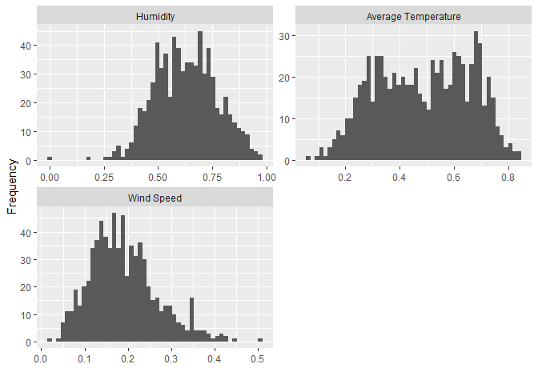
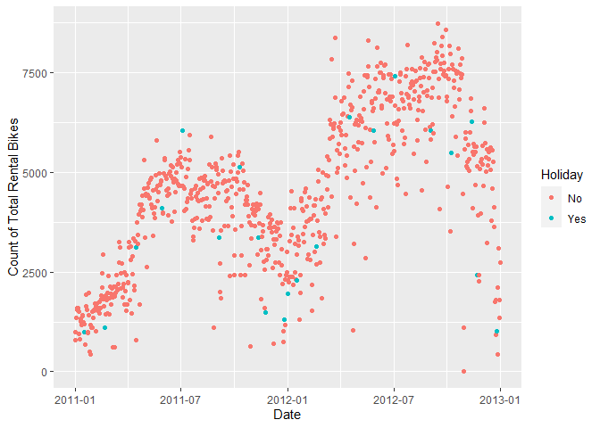
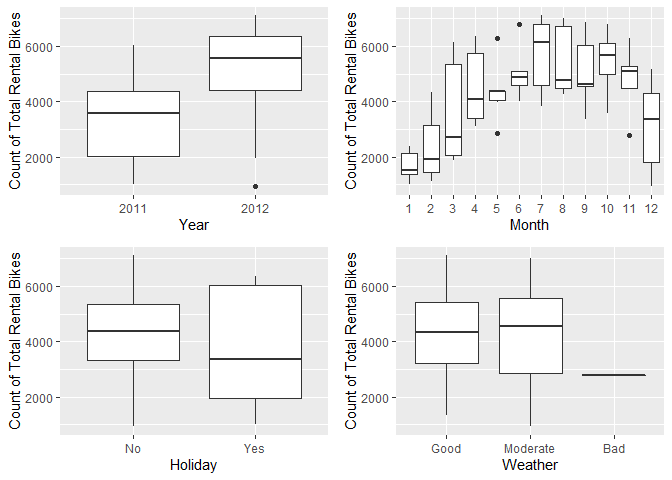
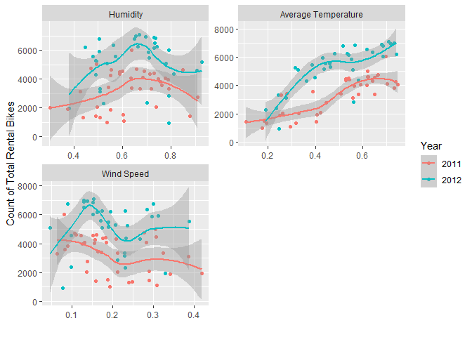
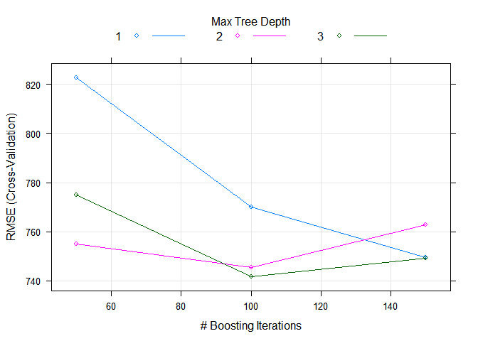

ST 558 Project 2
================
Hannah Park
10/15/2020

# Introduction

Bike sharing systems is a service in which bicycles are made available
for shared use to individuals on a short term basis. Bike share systems
allow individuals to rent a bike from a particular position and return
it at another through an automated process. This automated process,
which explicitly records departure and arrival positions and other
related observations such as date and duration of the rental, generates
a vast amount of data that can be used for research in areas such as
traffic, environmental and health issues, mobility in the city, and etc.
In this document, data on count of total rental bikes aggregated on
daily basis is used to create models for predicting the count using
predictors related to the day of the rental and the weather.

The original data set is related to the two-year historical log
corresponding to years 2011 and 2012 from Capital Bikeshare system,
Washington D.C., USA which is publicly available in
\[<http://capitalbikeshare.com/system-data>\]. The original data set
consists of the following variables:

  - instant: record index  
  - dteday : date  
  - season : season (1:springer, 2:summer, 3:fall, 4:winter)  
  - yr : year (0: 2011, 1:2012)  
  - mnth : month ( 1 to 12)  
  - holiday : weather day is holiday or not (extracted from [Department
    of HR Holiday Schedule](http://dchr.dc.gov/page/holiday-schedule))  
  - weekday : day of the week (0 to 6: Sunday to Monday)  
  - workingday : if day is neither weekend nor holiday is 1, otherwise
    is 0.  
  - weathersit :
      - 1: Clear, Few clouds, Partly cloudy, Partly cloudy  
      - 2: Mist + Cloudy, Mist + Broken clouds, Mist + Few clouds,
        Mist  
      - 3: Light Snow, Light Rain + Thunderstorm + Scattered clouds,
        Light Rain + Scattered clouds  
      - 4: Heavy Rain + Ice Pallets + Thunderstorm + Mist, Snow + Fog  
  - temp : Normalized temperature in Celsius. The values are divided to
    41 (max)  
  - atemp: Normalized feeling temperature in Celsius. The values are
    divided to 50 (max)  
  - hum: Normalized humidity. The values are divided to 100 (max)  
  - windspeed: Normalized wind speed. The values are divided to 67
    (max)  
  - casual: count of casual users  
  - registered: count of registered users  
  - cnt: count of total rental bikes including both casual and
    registered

A tree-based model chosen using leave one out cross validation(LOOCV)
and a boosted tree model chosen using cross-validation are used to model
the count of total rental bikes (cnt). Some variables from the original
data set were removed/transformed from the models to avoid
multicollinearity. Variables season and month (mnth), as well as
variables temp and atemp, were highly correlated with each other
according to the correlation plot (Figure 1 below). Variable month
(mnth) was chosen over variable season to minimize the loss of
information and also because month was more highly correlated with the
response variable (cnt) than season. Variables temp and atemp were
combined and their average was used in the models. Variables day of the
week (weekday) and working day were removed from the models due to their
irrelevance. Thus, the predictor variables used in the models are year
(yr), month (mnth), holiday, weather (weathersit), average temperature
(average of temp and atemp), humidity (hum), and wind speed (windspeed).

# Data

``` r
# Read in data
url <- "https://archive.ics.uci.edu/ml/machine-learning-databases/00275/Bike-Sharing-Dataset.zip"
download.file(url, "Bike-Sharing-Dataset.zip")
unzip("Bike-Sharing-Dataset.zip", exdir = "./Data")

df.bike <- read_csv("/Data/day.csv") %>%
  select(-instant, -casual, -registered) %>%
  mutate(dayofweek = dplyr::recode(weekday,
                            `0` = "Sunday",
                            `1` = "Monday",
                            `2` = "Tuesday",
                            `3` = "Wednesday",
                            `4` = "Thursday",
                            `5` = "Friday",
                            `6` = "Saturday")) %>%
  #Combine variables temp and atemp 
  mutate(avgTemp = (temp+atemp)/2)

# Filter by specific day of week
df.bike.day <- df.bike %>%
  filter(weekday == 1)

#Randomply sample from the data 
#Form training and test sets
set.seed(1109)
train <- sample(1:nrow(df.bike.day), size = nrow(df.bike.day)*0.7)
test <- dplyr::setdiff(1:nrow(df.bike.day), train)
df.train <- df.bike.day[train, ]
df.test <- df.bike.day[test, ]
```

# Summarizations

## Full Data

In this section, summary statistics and plots about the original data
are provided.

#### Figure 1. Correlation plot

Correlation between all pairs of variables are visualized. High
correlations are observed between variables season and month and between
temp and atemp.

``` r
corrplot(cor(df.bike[,2:13]))
```


#### Table 1. Qualitative variables: Contingency tables

Counts of number of holidays and counts of each weather category are
provided for each day of week. Factor levels of variable weathersit was
re-labeled as Good (1), Moderate (2), Bad (3), and Extreme (4). In years
2011 and 2012, no extreme weather was observed.

``` r
df.tbl <- apply_labels(df.bike,
                       dteday = "Date",
                       holiday = "Holiday",
                       holiday = c("No" = 0,
                                   "Yes" = 1),
                       weathersit = "Weather",
                       weathersit = c("Good" = 1,
                                      "Moderate" = 2,
                                      "Bad" = 3,
                                      "Extreme" = 4),
                       dayofweek = "Day of Week",
                       yr = "Year",
                       mnth = "Month",
                       avgTemp = "Average Temperature",
                       hum = "Humidity",
                       windspeed = "Wind Speed",
                       cnt = "Count of Total Rental Bikes")
attach(df.tbl)
cro_cases(list(holiday, weathersit), dayofweek,
          total_row_position = "none")
```

<table class="gmisc_table" style="border-collapse: collapse; margin-top: 1em; margin-bottom: 1em;">

<thead>

<tr>

<th style="border-top: 2px solid grey;">

</th>

<th colspan="7" style="font-weight: 900; border-bottom: 1px solid grey; border-top: 2px solid grey; text-align: center;">

 Day of Week 

</th>

</tr>

<tr>

<th style="border-bottom: 1px solid grey; font-weight: 900; text-align: center;">

</th>

<th style="font-weight: 900; border-bottom: 1px solid grey; text-align: center;">

 Friday 

</th>

<th style="font-weight: 900; border-bottom: 1px solid grey; text-align: center;">

 Monday 

</th>

<th style="font-weight: 900; border-bottom: 1px solid grey; text-align: center;">

 Saturday 

</th>

<th style="font-weight: 900; border-bottom: 1px solid grey; text-align: center;">

 Sunday 

</th>

<th style="font-weight: 900; border-bottom: 1px solid grey; text-align: center;">

 Thursday 

</th>

<th style="font-weight: 900; border-bottom: 1px solid grey; text-align: center;">

 Tuesday 

</th>

<th style="font-weight: 900; border-bottom: 1px solid grey; text-align: center;">

 Wednesday 

</th>

</tr>

</thead>

<tbody>

<tr>

<td colspan="8" style="font-weight: 900;">

 Holiday 

</td>

</tr>

<tr>

<td style="text-align: left;">

   No 

</td>

<td style="text-align: right;">

102

</td>

<td style="text-align: right;">

90

</td>

<td style="text-align: right;">

105

</td>

<td style="text-align: right;">

105

</td>

<td style="text-align: right;">

102

</td>

<td style="text-align: right;">

103

</td>

<td style="text-align: right;">

103

</td>

</tr>

<tr>

<td style="text-align: left;">

   Yes 

</td>

<td style="text-align: right;">

2

</td>

<td style="text-align: right;">

15

</td>

<td style="text-align: right;">

</td>

<td style="text-align: right;">

</td>

<td style="text-align: right;">

2

</td>

<td style="text-align: right;">

1

</td>

<td style="text-align: right;">

1

</td>

</tr>

<tr>

<td colspan="8" style="font-weight: 900;">

 Weather 

</td>

</tr>

<tr>

<td style="text-align: left;">

   Good 

</td>

<td style="text-align: right;">

63

</td>

<td style="text-align: right;">

66

</td>

<td style="text-align: right;">

67

</td>

<td style="text-align: right;">

74

</td>

<td style="text-align: right;">

67

</td>

<td style="text-align: right;">

62

</td>

<td style="text-align: right;">

64

</td>

</tr>

<tr>

<td style="text-align: left;">

   Moderate 

</td>

<td style="text-align: right;">

41

</td>

<td style="text-align: right;">

37

</td>

<td style="text-align: right;">

34

</td>

<td style="text-align: right;">

30

</td>

<td style="text-align: right;">

34

</td>

<td style="text-align: right;">

38

</td>

<td style="text-align: right;">

33

</td>

</tr>

<tr>

<td style="text-align: left;">

   Bad 

</td>

<td style="text-align: right;">

</td>

<td style="text-align: right;">

2

</td>

<td style="text-align: right;">

4

</td>

<td style="text-align: right;">

1

</td>

<td style="text-align: right;">

3

</td>

<td style="text-align: right;">

4

</td>

<td style="text-align: right;">

7

</td>

</tr>

<tr>

<td style="border-bottom: 2px solid grey; text-align: left;">

   Extreme 

</td>

<td style="border-bottom: 2px solid grey; text-align: right;">

</td>

<td style="border-bottom: 2px solid grey; text-align: right;">

</td>

<td style="border-bottom: 2px solid grey; text-align: right;">

</td>

<td style="border-bottom: 2px solid grey; text-align: right;">

</td>

<td style="border-bottom: 2px solid grey; text-align: right;">

</td>

<td style="border-bottom: 2px solid grey; text-align: right;">

</td>

<td style="border-bottom: 2px solid grey; text-align: right;">

</td>

</tr>

</tbody>

</table>

``` r
detach(df.tbl)
```

#### Figure 2. Histograms of quantitative variables

Histograms of the three quantitative variables (humidity, average
temperature, and wind speed) are provided. All three variables appear
approximately normal. Variables humidity and wind speed have outliers.

``` r
df.bike %>%
  gather(avgTemp, hum, windspeed, key = "var", value = "value") %>%
  mutate(var = factor(var, levels = c("hum", "avgTemp", "windspeed"))) %>%
  ggplot(aes(x = value)) +
  geom_histogram(bins = 50) +
  xlab("") +
  ylab("Frequency") +
  facet_wrap(~var, scales = "free", nrow = 2,
             labeller = as_labeller(c(hum = "Humidity", 
                                      avgTemp = "Average Temperature",
                                      windspeed = "Wind Speed"))) 
```

<!-- -->

#### Figure 3. Scatterplot of response variable(cnt) over days

Counts of total rental bikes are plotted against days. Counts were
generally higher in year 2012 than 2011, and counts were generally
higher in warmer months (June - September) than in colder months.
Whether a day was a holiday or not didn’t seem increase or decrease the
count when compared to the counts of bike rentals made a few days before
and after the holiday.

``` r
df.bike %>%
  mutate(Holiday = ifelse(holiday == 0, "No", "Yes")) %>%
  ggplot(aes(x = dteday, y = cnt)) +
  geom_point(aes(colour = Holiday)) +
  xlab("Date") +
  ylab("Count of Total Rental Bikes")
```

<!-- -->

## Specific Day of the Week Data

In this section, summary statistics and plots about the training data
used for modeling are provided. All statistics and plots are generated
from data set consisting of a specific day of the week only: Monday.

#### Table 2. Qualitative variables: Contingency tables

Counts of variables year, holiday, and weather are displayed for each
month.

``` r
df.tbl.train <- apply_labels(df.train,
                             dteday = "Date",
                             holiday = "Holiday",
                             holiday = c("No" = 0,
                                         "Yes" = 1),
                             weathersit = "Weather",
                             weathersit = c("Good" = 1,
                                            "Moderate" = 2,
                                            "Bad" = 3,
                                            "Extreme" = 4),
                             dayofweek = "Day of Week",
                             yr = "Year",
                             mnth = "Month",
                             avgTemp = "Average Temperature",
                             hum = "Humidity",
                             windspeed = "Wind Speed",
                             cnt = "Count of Total Rental Bikes")
                       
attach(df.tbl.train)
cro_cases(list(yr, holiday,weathersit), mnth,
          total_row_position = "none")
```

<table class="gmisc_table" style="border-collapse: collapse; margin-top: 1em; margin-bottom: 1em;">

<thead>

<tr>

<th style="border-top: 2px solid grey;">

</th>

<th colspan="12" style="font-weight: 900; border-bottom: 1px solid grey; border-top: 2px solid grey; text-align: center;">

 Month 

</th>

</tr>

<tr>

<th style="border-bottom: 1px solid grey; font-weight: 900; text-align: center;">

</th>

<th style="font-weight: 900; border-bottom: 1px solid grey; text-align: center;">

 1 

</th>

<th style="font-weight: 900; border-bottom: 1px solid grey; text-align: center;">

 2 

</th>

<th style="font-weight: 900; border-bottom: 1px solid grey; text-align: center;">

 3 

</th>

<th style="font-weight: 900; border-bottom: 1px solid grey; text-align: center;">

 4 

</th>

<th style="font-weight: 900; border-bottom: 1px solid grey; text-align: center;">

 5 

</th>

<th style="font-weight: 900; border-bottom: 1px solid grey; text-align: center;">

 6 

</th>

<th style="font-weight: 900; border-bottom: 1px solid grey; text-align: center;">

 7 

</th>

<th style="font-weight: 900; border-bottom: 1px solid grey; text-align: center;">

 8 

</th>

<th style="font-weight: 900; border-bottom: 1px solid grey; text-align: center;">

 9 

</th>

<th style="font-weight: 900; border-bottom: 1px solid grey; text-align: center;">

 10 

</th>

<th style="font-weight: 900; border-bottom: 1px solid grey; text-align: center;">

 11 

</th>

<th style="font-weight: 900; border-bottom: 1px solid grey; text-align: center;">

 12 

</th>

</tr>

</thead>

<tbody>

<tr>

<td colspan="13" style="font-weight: 900;">

 Year 

</td>

</tr>

<tr>

<td style="text-align: left;">

   0 

</td>

<td style="text-align: right;">

4

</td>

<td style="text-align: right;">

3

</td>

<td style="text-align: right;">

4

</td>

<td style="text-align: right;">

4

</td>

<td style="text-align: right;">

4

</td>

<td style="text-align: right;">

4

</td>

<td style="text-align: right;">

3

</td>

<td style="text-align: right;">

4

</td>

<td style="text-align: right;">

3

</td>

<td style="text-align: right;">

1

</td>

<td style="text-align: right;">

2

</td>

<td style="text-align: right;">

3

</td>

</tr>

<tr>

<td style="text-align: left;">

   1 

</td>

<td style="text-align: right;">

3

</td>

<td style="text-align: right;">

2

</td>

<td style="text-align: right;">

4

</td>

<td style="text-align: right;">

3

</td>

<td style="text-align: right;">

3

</td>

<td style="text-align: right;">

2

</td>

<td style="text-align: right;">

3

</td>

<td style="text-align: right;">

3

</td>

<td style="text-align: right;">

2

</td>

<td style="text-align: right;">

3

</td>

<td style="text-align: right;">

3

</td>

<td style="text-align: right;">

3

</td>

</tr>

<tr>

<td colspan="13" style="font-weight: 900;">

 Holiday 

</td>

</tr>

<tr>

<td style="text-align: left;">

   No 

</td>

<td style="text-align: right;">

4

</td>

<td style="text-align: right;">

3

</td>

<td style="text-align: right;">

8

</td>

<td style="text-align: right;">

6

</td>

<td style="text-align: right;">

6

</td>

<td style="text-align: right;">

6

</td>

<td style="text-align: right;">

5

</td>

<td style="text-align: right;">

7

</td>

<td style="text-align: right;">

3

</td>

<td style="text-align: right;">

3

</td>

<td style="text-align: right;">

4

</td>

<td style="text-align: right;">

5

</td>

</tr>

<tr>

<td style="text-align: left;">

   Yes 

</td>

<td style="text-align: right;">

3

</td>

<td style="text-align: right;">

2

</td>

<td style="text-align: right;">

</td>

<td style="text-align: right;">

1

</td>

<td style="text-align: right;">

1

</td>

<td style="text-align: right;">

</td>

<td style="text-align: right;">

1

</td>

<td style="text-align: right;">

</td>

<td style="text-align: right;">

2

</td>

<td style="text-align: right;">

1

</td>

<td style="text-align: right;">

1

</td>

<td style="text-align: right;">

1

</td>

</tr>

<tr>

<td colspan="13" style="font-weight: 900;">

 Weather 

</td>

</tr>

<tr>

<td style="text-align: left;">

   Good 

</td>

<td style="text-align: right;">

4

</td>

<td style="text-align: right;">

3

</td>

<td style="text-align: right;">

7

</td>

<td style="text-align: right;">

5

</td>

<td style="text-align: right;">

3

</td>

<td style="text-align: right;">

3

</td>

<td style="text-align: right;">

5

</td>

<td style="text-align: right;">

5

</td>

<td style="text-align: right;">

1

</td>

<td style="text-align: right;">

</td>

<td style="text-align: right;">

4

</td>

<td style="text-align: right;">

3

</td>

</tr>

<tr>

<td style="text-align: left;">

   Moderate 

</td>

<td style="text-align: right;">

3

</td>

<td style="text-align: right;">

2

</td>

<td style="text-align: right;">

1

</td>

<td style="text-align: right;">

2

</td>

<td style="text-align: right;">

4

</td>

<td style="text-align: right;">

3

</td>

<td style="text-align: right;">

1

</td>

<td style="text-align: right;">

2

</td>

<td style="text-align: right;">

4

</td>

<td style="text-align: right;">

4

</td>

<td style="text-align: right;">

</td>

<td style="text-align: right;">

3

</td>

</tr>

<tr>

<td style="text-align: left;">

   Bad 

</td>

<td style="text-align: right;">

</td>

<td style="text-align: right;">

</td>

<td style="text-align: right;">

</td>

<td style="text-align: right;">

</td>

<td style="text-align: right;">

</td>

<td style="text-align: right;">

</td>

<td style="text-align: right;">

</td>

<td style="text-align: right;">

</td>

<td style="text-align: right;">

</td>

<td style="text-align: right;">

</td>

<td style="text-align: right;">

1

</td>

<td style="text-align: right;">

</td>

</tr>

<tr>

<td style="border-bottom: 2px solid grey; text-align: left;">

   Extreme 

</td>

<td style="border-bottom: 2px solid grey; text-align: right;">

</td>

<td style="border-bottom: 2px solid grey; text-align: right;">

</td>

<td style="border-bottom: 2px solid grey; text-align: right;">

</td>

<td style="border-bottom: 2px solid grey; text-align: right;">

</td>

<td style="border-bottom: 2px solid grey; text-align: right;">

</td>

<td style="border-bottom: 2px solid grey; text-align: right;">

</td>

<td style="border-bottom: 2px solid grey; text-align: right;">

</td>

<td style="border-bottom: 2px solid grey; text-align: right;">

</td>

<td style="border-bottom: 2px solid grey; text-align: right;">

</td>

<td style="border-bottom: 2px solid grey; text-align: right;">

</td>

<td style="border-bottom: 2px solid grey; text-align: right;">

</td>

<td style="border-bottom: 2px solid grey; text-align: right;">

</td>

</tr>

</tbody>

</table>

``` r
detach(df.tbl.train)
```

#### Table 3. Quantitative variables: Summary statistics

Minimum, median, mean, and max of the three qualitative variables
(average temperature, humidity, and wind speed) are displayed.

``` r
df.tbl.train %>%
  tab_cells(avgTemp, hum, windspeed) %>%
  tab_cols(mnth) %>%
  tab_stat_fun(Minimum = w_min, Median = w_median, 
               Mean = w_mean, Max = w_max) %>%
  tab_pivot()
```

<table class="gmisc_table" style="border-collapse: collapse; margin-top: 1em; margin-bottom: 1em;">

<thead>

<tr>

<th style="border-top: 2px solid grey;">

</th>

<th colspan="12" style="font-weight: 900; border-bottom: 1px solid grey; border-top: 2px solid grey; text-align: center;">

 Month 

</th>

</tr>

<tr>

<th style="border-bottom: 1px solid grey; font-weight: 900; text-align: center;">

</th>

<th style="font-weight: 900; border-bottom: 1px solid grey; text-align: center;">

 1 

</th>

<th style="font-weight: 900; border-bottom: 1px solid grey; text-align: center;">

 2 

</th>

<th style="font-weight: 900; border-bottom: 1px solid grey; text-align: center;">

 3 

</th>

<th style="font-weight: 900; border-bottom: 1px solid grey; text-align: center;">

 4 

</th>

<th style="font-weight: 900; border-bottom: 1px solid grey; text-align: center;">

 5 

</th>

<th style="font-weight: 900; border-bottom: 1px solid grey; text-align: center;">

 6 

</th>

<th style="font-weight: 900; border-bottom: 1px solid grey; text-align: center;">

 7 

</th>

<th style="font-weight: 900; border-bottom: 1px solid grey; text-align: center;">

 8 

</th>

<th style="font-weight: 900; border-bottom: 1px solid grey; text-align: center;">

 9 

</th>

<th style="font-weight: 900; border-bottom: 1px solid grey; text-align: center;">

 10 

</th>

<th style="font-weight: 900; border-bottom: 1px solid grey; text-align: center;">

 11 

</th>

<th style="font-weight: 900; border-bottom: 1px solid grey; text-align: center;">

 12 

</th>

</tr>

</thead>

<tbody>

<tr>

<td colspan="13" style="font-weight: 900;">

 Average Temperature 

</td>

</tr>

<tr>

<td style="text-align: left;">

   Minimum 

</td>

<td style="text-align: right;">

0.1

</td>

<td style="text-align: right;">

0.3

</td>

<td style="text-align: right;">

0.2

</td>

<td style="text-align: right;">

0.4

</td>

<td style="text-align: right;">

0.5

</td>

<td style="text-align: right;">

0.6

</td>

<td style="text-align: right;">

0.7

</td>

<td style="text-align: right;">

0.6

</td>

<td style="text-align: right;">

0.5

</td>

<td style="text-align: right;">

0.4

</td>

<td style="text-align: right;">

0.3

</td>

<td style="text-align: right;">

0.2

</td>

</tr>

<tr>

<td style="text-align: left;">

   Median 

</td>

<td style="text-align: right;">

0.2

</td>

<td style="text-align: right;">

0.4

</td>

<td style="text-align: right;">

0.4

</td>

<td style="text-align: right;">

0.6

</td>

<td style="text-align: right;">

0.6

</td>

<td style="text-align: right;">

0.6

</td>

<td style="text-align: right;">

0.7

</td>

<td style="text-align: right;">

0.7

</td>

<td style="text-align: right;">

0.6

</td>

<td style="text-align: right;">

0.5

</td>

<td style="text-align: right;">

0.4

</td>

<td style="text-align: right;">

0.3

</td>

</tr>

<tr>

<td style="text-align: left;">

   Mean 

</td>

<td style="text-align: right;">

0.2

</td>

<td style="text-align: right;">

0.3

</td>

<td style="text-align: right;">

0.4

</td>

<td style="text-align: right;">

0.5

</td>

<td style="text-align: right;">

0.6

</td>

<td style="text-align: right;">

0.6

</td>

<td style="text-align: right;">

0.7

</td>

<td style="text-align: right;">

0.7

</td>

<td style="text-align: right;">

0.6

</td>

<td style="text-align: right;">

0.5

</td>

<td style="text-align: right;">

0.4

</td>

<td style="text-align: right;">

0.3

</td>

</tr>

<tr>

<td style="text-align: left;">

   Max 

</td>

<td style="text-align: right;">

0.3

</td>

<td style="text-align: right;">

0.4

</td>

<td style="text-align: right;">

0.5

</td>

<td style="text-align: right;">

0.6

</td>

<td style="text-align: right;">

0.7

</td>

<td style="text-align: right;">

0.7

</td>

<td style="text-align: right;">

0.7

</td>

<td style="text-align: right;">

0.7

</td>

<td style="text-align: right;">

0.7

</td>

<td style="text-align: right;">

0.6

</td>

<td style="text-align: right;">

0.5

</td>

<td style="text-align: right;">

0.4

</td>

</tr>

<tr>

<td colspan="13" style="font-weight: 900;">

 Humidity 

</td>

</tr>

<tr>

<td style="text-align: left;">

   Minimum 

</td>

<td style="text-align: right;">

0.4

</td>

<td style="text-align: right;">

0.4

</td>

<td style="text-align: right;">

0.3

</td>

<td style="text-align: right;">

0.4

</td>

<td style="text-align: right;">

0.6

</td>

<td style="text-align: right;">

0.5

</td>

<td style="text-align: right;">

0.4

</td>

<td style="text-align: right;">

0.5

</td>

<td style="text-align: right;">

0.7

</td>

<td style="text-align: right;">

0.6

</td>

<td style="text-align: right;">

0.5

</td>

<td style="text-align: right;">

0.5

</td>

</tr>

<tr>

<td style="text-align: left;">

   Median 

</td>

<td style="text-align: right;">

0.5

</td>

<td style="text-align: right;">

0.5

</td>

<td style="text-align: right;">

0.5

</td>

<td style="text-align: right;">

0.6

</td>

<td style="text-align: right;">

0.7

</td>

<td style="text-align: right;">

0.6

</td>

<td style="text-align: right;">

0.7

</td>

<td style="text-align: right;">

0.7

</td>

<td style="text-align: right;">

0.8

</td>

<td style="text-align: right;">

0.7

</td>

<td style="text-align: right;">

0.6

</td>

<td style="text-align: right;">

0.7

</td>

</tr>

<tr>

<td style="text-align: left;">

   Mean 

</td>

<td style="text-align: right;">

0.5

</td>

<td style="text-align: right;">

0.6

</td>

<td style="text-align: right;">

0.5

</td>

<td style="text-align: right;">

0.6

</td>

<td style="text-align: right;">

0.7

</td>

<td style="text-align: right;">

0.6

</td>

<td style="text-align: right;">

0.6

</td>

<td style="text-align: right;">

0.6

</td>

<td style="text-align: right;">

0.8

</td>

<td style="text-align: right;">

0.7

</td>

<td style="text-align: right;">

0.7

</td>

<td style="text-align: right;">

0.7

</td>

</tr>

<tr>

<td style="text-align: left;">

   Max 

</td>

<td style="text-align: right;">

0.7

</td>

<td style="text-align: right;">

0.9

</td>

<td style="text-align: right;">

0.7

</td>

<td style="text-align: right;">

0.8

</td>

<td style="text-align: right;">

0.8

</td>

<td style="text-align: right;">

0.8

</td>

<td style="text-align: right;">

0.8

</td>

<td style="text-align: right;">

0.7

</td>

<td style="text-align: right;">

0.8

</td>

<td style="text-align: right;">

0.8

</td>

<td style="text-align: right;">

0.9

</td>

<td style="text-align: right;">

0.9

</td>

</tr>

<tr>

<td colspan="13" style="font-weight: 900;">

 Wind Speed 

</td>

</tr>

<tr>

<td style="text-align: left;">

   Minimum 

</td>

<td style="text-align: right;">

0.1

</td>

<td style="text-align: right;">

0.2

</td>

<td style="text-align: right;">

0.1

</td>

<td style="text-align: right;">

0.2

</td>

<td style="text-align: right;">

0.1

</td>

<td style="text-align: right;">

0.1

</td>

<td style="text-align: right;">

0.1

</td>

<td style="text-align: right;">

0.1

</td>

<td style="text-align: right;">

0.1

</td>

<td style="text-align: right;">

0.1

</td>

<td style="text-align: right;">

0.0

</td>

<td style="text-align: right;">

0.1

</td>

</tr>

<tr>

<td style="text-align: left;">

   Median 

</td>

<td style="text-align: right;">

0.2

</td>

<td style="text-align: right;">

0.3

</td>

<td style="text-align: right;">

0.2

</td>

<td style="text-align: right;">

0.3

</td>

<td style="text-align: right;">

0.2

</td>

<td style="text-align: right;">

0.2

</td>

<td style="text-align: right;">

0.1

</td>

<td style="text-align: right;">

0.2

</td>

<td style="text-align: right;">

0.2

</td>

<td style="text-align: right;">

0.1

</td>

<td style="text-align: right;">

0.2

</td>

<td style="text-align: right;">

0.1

</td>

</tr>

<tr>

<td style="text-align: left;">

   Mean 

</td>

<td style="text-align: right;">

0.2

</td>

<td style="text-align: right;">

0.3

</td>

<td style="text-align: right;">

0.2

</td>

<td style="text-align: right;">

0.3

</td>

<td style="text-align: right;">

0.2

</td>

<td style="text-align: right;">

0.2

</td>

<td style="text-align: right;">

0.2

</td>

<td style="text-align: right;">

0.2

</td>

<td style="text-align: right;">

0.2

</td>

<td style="text-align: right;">

0.2

</td>

<td style="text-align: right;">

0.2

</td>

<td style="text-align: right;">

0.1

</td>

</tr>

<tr>

<td style="border-bottom: 2px solid grey; text-align: left;">

   Max 

</td>

<td style="border-bottom: 2px solid grey; text-align: right;">

0.3

</td>

<td style="border-bottom: 2px solid grey; text-align: right;">

0.4

</td>

<td style="border-bottom: 2px solid grey; text-align: right;">

0.4

</td>

<td style="border-bottom: 2px solid grey; text-align: right;">

0.4

</td>

<td style="border-bottom: 2px solid grey; text-align: right;">

0.2

</td>

<td style="border-bottom: 2px solid grey; text-align: right;">

0.3

</td>

<td style="border-bottom: 2px solid grey; text-align: right;">

0.3

</td>

<td style="border-bottom: 2px solid grey; text-align: right;">

0.3

</td>

<td style="border-bottom: 2px solid grey; text-align: right;">

0.2

</td>

<td style="border-bottom: 2px solid grey; text-align: right;">

0.3

</td>

<td style="border-bottom: 2px solid grey; text-align: right;">

0.3

</td>

<td style="border-bottom: 2px solid grey; text-align: right;">

0.2

</td>

</tr>

</tbody>

</table>

#### Figure 4. Qualitative variables: Boxplots

Boxplots of qualitative variables (year, month, holiday and weather) are
displayed.

``` r
boxplot1 <- df.train %>%
  ggplot(aes(x = factor(mnth), y = cnt)) +
  geom_boxplot() +
  xlab("Month") +
  ylab("Count of Total Rental Bikes")

boxplot2 <- df.train %>%
  ggplot(aes(x = factor(weathersit), y = cnt)) +
  geom_boxplot() +
  xlab("Weather") +
  ylab("Count of Total Rental Bikes") +
  scale_x_discrete(limits = c("1", "2", "3"),
                   labels = c("1" = "Good", "2" = "Moderate", "3" = "Bad"))

boxplot3 <- df.train %>%
  ggplot(aes(x = factor(holiday), y = cnt)) +
  geom_boxplot() +
  xlab("Holiday") +
  ylab("Count of Total Rental Bikes") +
  scale_x_discrete(limits = c("0", "1"),
                   labels = c("0" = "No", "1" = "Yes"))

boxplot4 <- df.train %>%
  ggplot(aes(x = factor(yr), y = cnt)) +
  geom_boxplot() +
  xlab("Year") +
  ylab("Count of Total Rental Bikes") +
  scale_x_discrete(limits = c("0", "1"),
                   labels = c("0" = "2011", "1" = "2012")) 

grid.arrange(boxplot4, boxplot1, boxplot3, boxplot2)
```

<!-- -->

#### Figure 5. Quantitative variables: Scatterplots

Scatterplot of quantitative variables (Humidity, Average Temperature,
and Wind Speed) are displayed.

``` r
df.train %>%
  gather(avgTemp, hum, windspeed, key = "var", value = "value") %>%
  mutate(var = factor(var, levels = c("hum", "avgTemp", "windspeed")),
         Year = ifelse(yr == 0, "2011", "2012")) %>%
  ggplot(aes(x = value, y = cnt, color = Year)) +
  geom_point() +
  geom_smooth(aes(group = Year)) +
  xlab("") +
  ylab("Count of Total Rental Bikes") +
  facet_wrap(~var, scales = "free", nrow = 2,
             labeller = as_labeller(c(hum = "Humidity", 
                                      avgTemp = "Average Temperature",
                                      windspeed = "Wind Speed"))) 
```

<!-- -->

# Modeling

Two models are fitted: a tree-based model chosen using leave one out
cross validation (LOOCV) that is non-ensemble and a boosted tree model
chosen using cross-validation (CV). For both models, the response
variable is the **Count of Total Rental Bikes** (cnt), and the predictor
variables are year (yr), month (mnth), holiday, weather (weathersit),
average temperature (average of temp and atemp), humidity (hum), and
wind speed (windspeed).

## Tree-based Model

A regression tree is fitted using recursive binary splitting to predict
the continous response cnt. For every possible value of each predictor,
the optimal value that minimizes the Residual Sum of Squares (RSS) is
found, and the predictor and its optimal value with the smallest RSS is
chosen to split the predictor space into two. This process is repeated
to further split the predictor space into several regions (nodes of the
tree). To avoid overfitting the data, LOOCV is used to prune back the
tree and choose the right number of nodes that decreases variance but
improves prediction.

#### Model fit

``` r
fit.tree <- train(cnt ~ yr + mnth + holiday + weathersit + avgTemp + hum + windspeed,
                  data = df.train,
                  method = "rpart",
                  trControl = trainControl(method = "LOOCV"))
```

#### Final chosen model

``` r
fit.tree$results
```

    ##           cp     RMSE    Rsquared      MAE
    ## 1 0.07039248 1280.707 0.471340268 1002.023
    ## 2 0.17230882 1406.555 0.359472345 1243.783
    ## 3 0.45969184 1959.403 0.007081118 1770.250

``` r
fancyRpartPlot(fit.tree$finalModel)
```

<!-- -->

``` r
fit.tree$bestTune
```

    ##           cp
    ## 1 0.07039248

#### Predictions on the test set

``` r
treePred <- predict(fit.tree, newdata = df.test)
treeRMSE <- sqrt(mean((treePred-df.test$cnt)^2))
```

## Boosted Tree Model

In a boosted tree model, tree are added subsequentially, resulting in
slow training of trees that helps prevent overfitting of the data.
Boosted tree model sequentially combines trees: each new tree fits to
the residuals from the previous step. There are three tuning parameters
associated with boosting: \(\lambda\) - a shrinkage parameter that slows
the fitting process, *B* - number of boosting iterations, and *d* -
maximum tree depth. Cross validation (CV) is used in our model to select
the tuning parameters.

#### Model fit

``` r
fit.boost <- train(cnt ~ yr + mnth + holiday + weathersit + avgTemp + hum + windspeed, 
                   data = df.train,
                   method = "gbm",
                   trControl = trainControl(method = "cv", number = 10),
                   verbose = FALSE)
```

#### Final chosen model

``` r
fit.boost$results
```

    ##   shrinkage interaction.depth n.minobsinnode n.trees     RMSE  Rsquared
    ## 1       0.1                 1             10      50 822.7659 0.7826529
    ## 4       0.1                 2             10      50 755.0458 0.8068934
    ## 7       0.1                 3             10      50 775.0523 0.7986783
    ## 2       0.1                 1             10     100 770.0274 0.8036290
    ## 5       0.1                 2             10     100 745.4788 0.8152745
    ## 8       0.1                 3             10     100 741.6463 0.8181918
    ## 3       0.1                 1             10     150 749.4813 0.8093348
    ## 6       0.1                 2             10     150 762.7653 0.8135532
    ## 9       0.1                 3             10     150 749.2553 0.8189545
    ##        MAE   RMSESD RsquaredSD    MAESD
    ## 1 679.8976 288.8993  0.1758262 188.5489
    ## 4 594.1796 309.1696  0.1597330 191.6425
    ## 7 632.5262 280.1477  0.1544765 169.4023
    ## 2 612.7792 275.7530  0.1479579 177.8962
    ## 5 587.7916 273.1966  0.1289282 160.2560
    ## 8 587.4932 246.0611  0.1247724 138.7681
    ## 3 605.5542 278.7460  0.1402884 185.2457
    ## 6 595.4793 258.4645  0.1230508 147.5624
    ## 9 588.8263 249.0724  0.1269573 141.1556

``` r
plot(fit.boost)
```

<!-- -->

``` r
fit.boost$bestTune
```

    ##   n.trees interaction.depth shrinkage n.minobsinnode
    ## 8     100                 3       0.1             10

#### Predictions on the test set

``` r
boostPred <- predict(fit.boost, newdata = df.test)
boostRMSE <- sqrt(mean((boostPred-df.test$cnt)^2))
```

# Model Comparison

``` r
tbl.rmse <- rbind.data.frame("tree" = treeRMSE, "boost" = boostRMSE)
colnames(tbl.rmse) <- "RMSE"
rownames(tbl.rmse) <- c("Reg. Tree", "Boost Tree")
kable(tbl.rmse, caption = "Comparison of Models' RMSE")
```

|            |     RMSE |
| ---------- | -------: |
| Reg. Tree  | 1423.966 |
| Boost Tree | 1029.307 |

Comparison of Models’ RMSE
